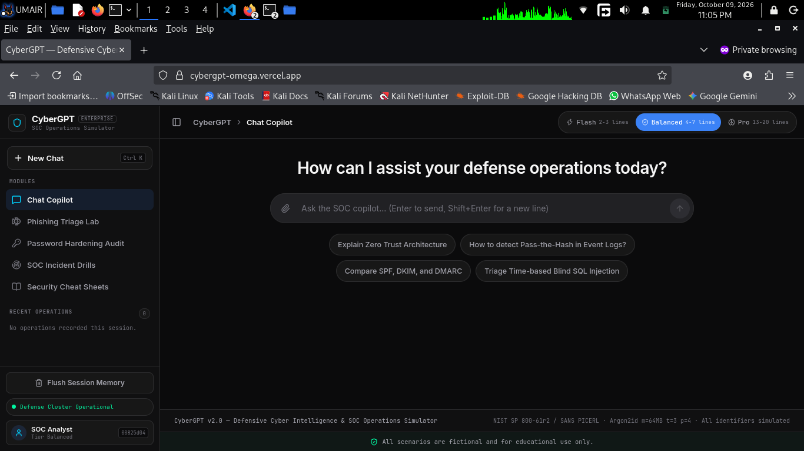

<div align="center">

# 🛡️ CyberGPT — Enterprise SOC Intelligence & Threat Defense Platform

[](https://cybergpt-omega.vercel.app)
[](https://cybergpt-omega.vercel.app)
[](LICENSE)

<p align="center">
  <b>Autonomous Cyber Defense Copilot • Interactive SOC Incident Response Labs • Password Hardening Engine</b>
</p>

<!-- Live Application Preview Banner -->
<p align="center">
  <a href="https://cybergpt-omega.vercel.app" target="_blank">
    
  </a>
</p>

[🌐 Open Live Web App](https://cybergpt-omega.vercel.app) • [🎯 Key Modules](#-key-modules) • [🛠️ Tech Stack](#️-technology-stack) • [⚙️ Local Setup](#️-quickstart--local-setup) • [📜 Educational Disclaimer](#-compliance--educational-disclaimer)

</div>

---

## ⚡ Overview

**CyberGPT** is an enterprise-grade defensive cybersecurity training platform and autonomous AI incident response copilot. Designed for SOC analysts, incident commanders, blue teamers, and security researchers, CyberGPT enables real-time threat telemetry parsing, hands-on detection drills, and instant AI-driven defensive guidance.

Deployed on serverless cloud edge infrastructure, the platform delivers high-throughput inference without cold-start delays.

---

## 🎯 Key Modules

### 1. 💬 AI SOC Mentor (Multi-Tier Orchestration)
Integrated directly with NVIDIA NIM high-performance inference models featuring automated failover and 3 calibrated response depth tiers:
* **⚡ Flash Tier (2–3 Lines):** Low-latency triage facts and rapid IoC correlation (~2-3s response time).
* **🛡️ Balanced Tier (4–7 Lines):** Vulnerability mechanics, detection engineering rules, and Sysmon query telemetry.
* **🧠 Pro Tier (13–20 Lines):** Full executive threat briefings, MITRE ATT&CK matrix mappings, Sigma detection rules, and hardened remediation commands.

### 2. 🎣 Phishing Triage Simulator (TryHackMe Style)
* **Real-World Attack Vectors:** Payroll Diversion Phishing, Quishing (QR code MFA interception), Illicit OAuth 2.0 Consent Grants, and Staged LNK Archives.
* **Safe RFC Documentation Ranges:** Strictly utilizes RFC 2606 reserved domains (`.example`) and RFC 5737 documentation subnets (`203.0.113.0/24`, `198.51.100.0/24`).
* **SANS PICERL Framework:** Automated decision evaluations featuring actionable remediation steps and collapsible technical hints.

### 3. 🔐 Deterministic Password Audit & Enterprise Hardening
* Mathematical Shannon entropy calculation executing purely client-side without keystroke logging.
* Instant generation of enterprise-hardened variants (e.g., `ZacPaul0890` ➔ `^%$Zac%Paul0890_#Sec99`) with 1-click clipboard copying.
* Production-standard Argon2id (`m=64MB, t=3, p=4`) and bcrypt hashing guidelines.

### 4. 🚨 SOC Incident Response Drills
* Interactive investigation of raw EDR, Sysmon, and CloudTrail telemetry across **Endpoint Defense**, **Active Directory**, **Web AppSec**, and **Cloud Infrastructure**.
* Scenarios include: Obfuscated PowerShell C2 execution, RDP Brute Force (`Event 4625` ➔ `4624 Type 10`), Kerberoasting (`RC4 0x17`), Lateral Movement via PsExec (`Event 7045`), Time-based Blind SQL Injection, and AWS S3 Public Bucket Exposure.

### 5. 📑 3-Tier Defensive Reference Matrices (Cheat Sheets)
* **🟢 Beginner:** Critical Port Threats (21, 22, 53, 80, 443, 445, 3389), Essential Linux Hardening Commands, and Nmap Reconnaissance flags.
* **🟡 Intermediate:** OWASP Top 10 Architectural Countermeasures, Windows Security Event IDs (`4624`, `4625`, `4688`, `7045`), and Sysmon telemetry guides.
* **🔴 Advanced:** Active Directory Exploit Defense (Kerberoasting, DCSync), Splunk SPL Threat Hunting Queries, and Volatility 3 Memory Forensics commands.

---

## 🛠️ Technology Stack

| Layer | Component |
| :--- | :--- |
| **Backend Framework** | Python 3, Flask, Gunicorn |
| **AI / LLM Orchestration** | NVIDIA NIM API (`https://integrate.api.nvidia.com/v1`) |
| **Frontend Architecture** | Tailwind CSS (Obsidian Dark Theme), Shadcn UI Design Principles |
| **Typography & Icons** | Inter, JetBrains Mono, Lucide Icons |
| **Deployment & Hosting** | Vercel Serverless Edge Architecture |

---

## ⚙️ Quickstart / Local Setup

To run CyberGPT locally in your environment:

### 1. Clone the Repository
```bash
git clone [https://github.com/umairs759/cybergpt.git](https://github.com/umairs759/cybergpt.git)
cd cybergpt
```

## 2. Virtual Environment Setup
```
python3 -m venv .venv
source .venv/bin/activate
pip install -r requirements.txt
```

### 3. Configure API Credentials
Create a .env file in the project root:
```SECRET_KEY=cybersentry-soc-enterprise-key-2026
NVIDIA_BASE_URL=[https://integrate.api.nvidia.com/v1](https://integrate.api.nvidia.com/v1)
NVIDIA_API_KEY=your_nvidia_api_key_here
```

## 4. Launch Application
```python3 app.py
```
Open your browser and navigate to http://127.0.0.1:5000

## 📜 Compliance & Educational Disclaimer
Notice: All scenarios, raw event telemetry logs, headers, domain names, and forensic artifacts within CyberGPT are entirely fictional and engineered strictly for educational defense training. Real brand lookalikes have been substituted with RFC 2606 reserved namespaces (.example, .test) and RFC 5737 documentation network ranges (198.51.100.0/24, 203.0.113.0/24).
